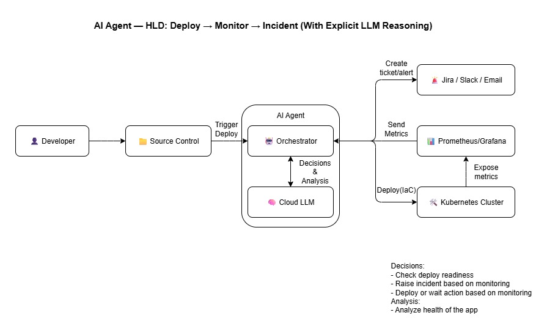

## High-Level Design



# AI Agent: Deploy → Monitor → Incident — Suggested Tech Stack

| Aspect                | Recommended Option                                         | Why is this good?                                      |
|-----------------------|------------------------------------------------------------|--------------------------------------------------------|
| **Programming Language** | Python                                                | Simple, flexible, best for AI orchestration.          |
| **LLM**               | Mistral 7B (or Llama 3 8B)                                   | Open-weight, strong for multi-step reasoning.          |
| **LLM Runner & Hosting** | mistrai.ai                              | Runs the model in the cloud and can be called by scripts or an API, no local GPU needed.      |
| **Framework**         | LangChain OSS                                              | Connects LLM, tools, APIs, and workflows.              |
| **IDE**               | VS Code                                                    | Great for Python, virtualenvs, and REST calls.         |
| **Infra as Code**     | Terraform (or Helm)                                          | Automates cloud resources and app deploys.             |
| **Monitoring**        | Prometheus                                  | Collects metrics; open source.          |
| **Incident Mgmt**     | Jira API, Email, GitHub Issues              | Creates tickets or alerts automatically.               |
| **Version Control**   | Git + GitHub                                               | Tracks changes and supports collaboration.             |

<h1>Low-Level Design</h1>

<p align="center">
  
</p>

## How to Run This Project

Follow these steps to set up and run the AI SDLC Agent on your local machine.

### 1. Prerequisites

Ensure you have the following software installed:

- **Python 3.9+**: The core language for the agent.
- **Git**: For cloning the repository and interacting with GitHub.
- **Docker Desktop**: The agent deploys applications as Docker containers. Make sure the Docker engine is running.
- **ngrok** or **Tailscale Funnel**: A tool to create a secure tunnel to your local machine, allowing GitHub's webhooks to reach your development server.

### 2. Setup and Configuration

1.  **Clone the Repository**:
    ```bash
    git clone <your-repository-url>
    cd sdlc-agent
    ```

2.  **Create and Activate a Virtual Environment**:
    It's a best practice to isolate project dependencies.
    ```bash
    # For Windows
    python -m venv venv
    .\venv\Scripts\activate

    # For macOS/Linux
    python3 -m venv venv
    source venv/bin/activate
    ```

3.  **Install Dependencies**:
    Install all required Python packages.
    ```bash
    pip install -r requirements.txt
    ```

4.  **Configure Environment Variables**:
    Create a file named `.env` in the root of the project. This file will hold all your secrets and configuration settings.

    ```env
    # --- GitHub Configuration ---
    # Personal Access Token with 'repo' and 'workflow' scopes.
    GITHUB_TOKEN="ghp_..."
    # A secret string you will also add to the GitHub webhook settings for security.
    GITHUB_WEBHOOK_SECRET="your_strong_secret_here"

    # --- LLM Configuration ---
    MISTRAL_API_KEY="your_mistral_api_key"

    # --- Monitoring Configuration ---
    PROMETHEUS_URL="http://localhost:9090" # URL of your Prometheus instance.

    # --- Incident Management (Optional) ---
    JIRA_URL="https://your-domain.atlassian.net"
    JIRA_USER="your-jira-email@example.com"
    JIRA_API_TOKEN="your_jira_api_token"

    EMAIL_SMTP_SERVER="smtp.gmail.com"
    EMAIL_PORT=587
    EMAIL_USER="your-email@gmail.com"
    EMAIL_PASSWORD="your_google_app_password" # Use an App Password for services like Gmail.
    ```

### 3. Running the Agent

1.  **Start the Webhook Server**:
    In a terminal, run the Flask application from the project root. It will listen on port `5001`.
    ```bash
    python -m src.webhook_server
    ```

2.  **Expose Your Server with a Tunnel**:
    Open a **new terminal** and start your tunneling service to create a public URL that forwards to port `5001`.
    ```bash
    # For ngrok
    ngrok http 5001

    # For Tailscale
    tailscale funnel 5001
    ```
    Your tunneling service will provide a public HTTPS URL. **Copy this URL.**

3.  **Configure the GitHub Webhook**:
    -   Navigate to the GitHub repository you want the agent to manage.
    -   Go to **Settings** > **Webhooks** and click **Add webhook**.
    -   **Payload URL**: Paste your public tunnel URL and add `/webhook` to the end.
    -   **Content type**: Set to `application/json`.
    -   **Secret**: Paste the value from your `GITHUB_WEBHOOK_SECRET` environment variable.
    -   **Events**: Select "Send me everything" for testing, or customize to "Pushes" and "Pull requests".
    -   Click **Add webhook**.

### 4. Testing the Workflow

Your agent is now live and ready to receive events.

-   **To test the direct deployment pipeline**:
    1.  In your test application's repository, create and push a commit to any branch **except `main`**.
    2.  Observe the agent's logs as it triggers the `orchestrate_branch_push_pipeline`.

-   **To test the full orchestrator pipeline**:
    1.  In your test application's repository, create and merge a Pull Request into the `main` branch.
    2.  Observe the agent's logs as it triggers the `orchestrate_pr_merge_pipeline`, which includes LLM-driven checks, deployment, and monitoring.

