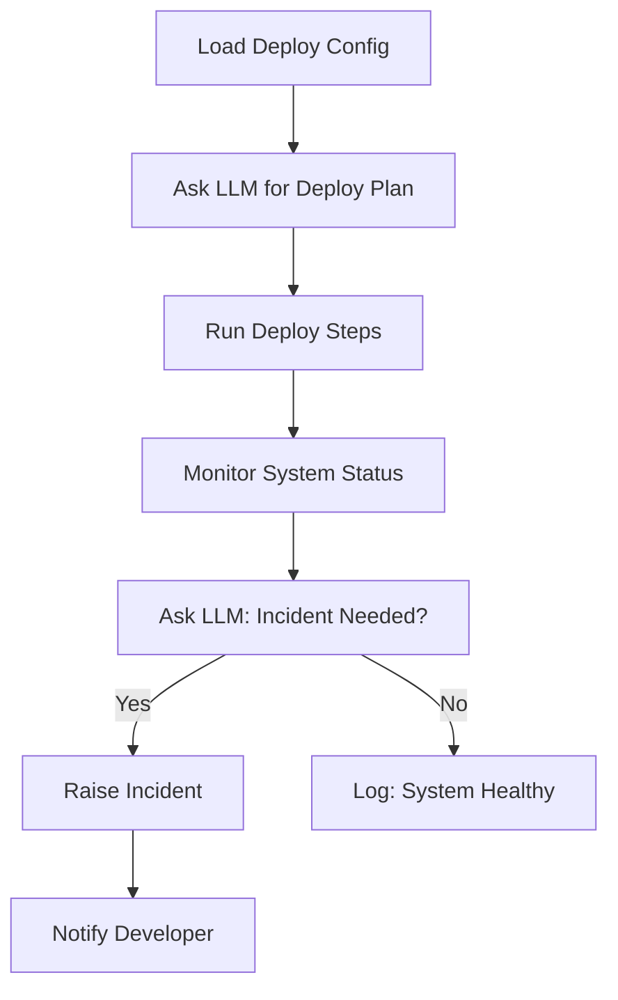

```mermaid
flowchart TD
    A[Load Deploy Config] --> B[Ask LLM for Deploy Plan]
    B --> C[Run Deploy Steps]
    C --> D[Monitor System Status]
    D --> E[Ask LLM: Incident Needed?]
    E -- Yes --> F[Raise Incident]
    F --> G[Notify Developer]
    E -- No --> H[Log: System Healthy]
```